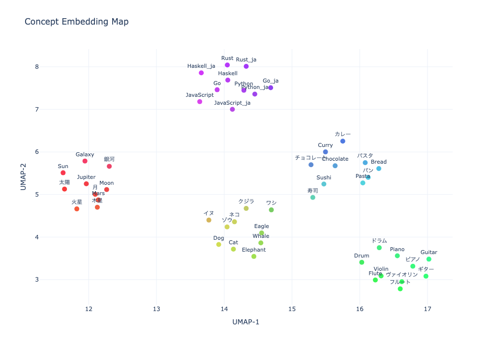
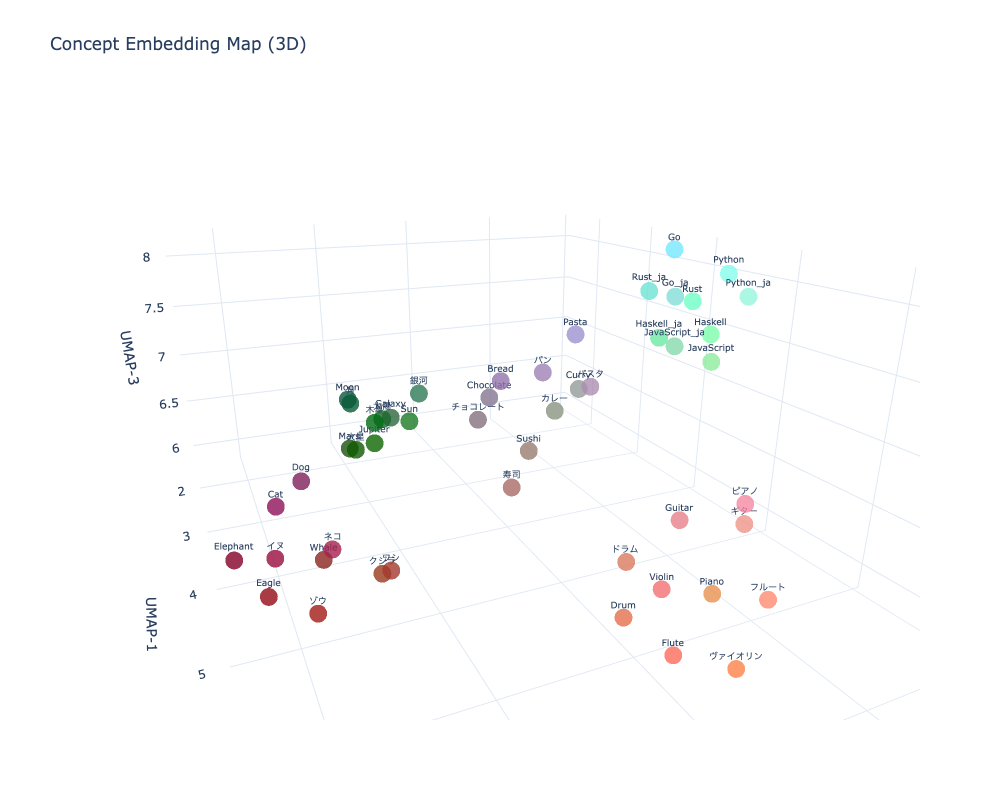

# concept-file

ベクターデータベースなしのポータブルなセマンティック検索。ファイルと `find` と `sort` だけ。

## これは何？

`.concept` はテキスト、埋め込みベクトル、来歴情報を1つのファイルにまとめるプレーンテキスト形式のファイルフォーマットです。各 `.concept` ファイルは1つの「概念」を表し、標準的なファイルシステムツールで比較・検索・整理できます。

**ベクターデータベースは不要です。** ファイルをコピーすれば知識が移動します。`find` で発見し、`sort` で順位付けし、`diff` で変更を追跡できます。

## なぜ？

| アプローチ | セットアップ | ポータビリティ | 中身の確認 |
|-----------|------------|--------------|-----------|
| Vector DB (Pinecone, Chroma 等) | サーバー/プロセスが必要 | エクスポート/インポートが必要 | バイナリで不透明 |
| `.concept` ファイル | セットアップ不要 | `cp` / `rsync` | `cat` / 任意のテキストエディタ |

`.concept` ファイルのディレクトリが、そのままナレッジベースです。マイグレーションもサーバーもロックインもありません。

## ファイルフォーマット

`.concept` ファイルは全体がプレーンテキストです:

```
CNCP v1 1432
{
  "concept": "Japanese AI Startup Trends",
  "version": "1.0",
  "created_at": "2026-03-14T10:00:00Z",
  "text": "Japanese AI startups have surged since 2024...",
  "embedding": {
    "model": "text-embedding-3-small",
    "dim": 1536,
    "vector": [0.0234, -0.1823, 0.0091, ...]
  },
  "provenance": {
    "source_url": "https://example.com/article",
    "pipeline": "fetch | extract_text | summarize | embed"
  }
}
```

詳細な仕様は [SPEC.md](SPEC.md) を参照してください。

## セットアップ

```bash
python -m venv .venv
source .venv/bin/activate
pip install openai
export OPENAI_API_KEY="sk-..."
```

## CLI ツール

### concept-embed

テキストから埋め込みベクトル付きの `.concept` ファイルを生成します。

```bash
# コマンドライン引数から
cli/concept-embed --name "My Concept" --text "埋め込みたいテキスト" -o output.concept

# 標準入力から
echo "埋め込みたいテキスト" | cli/concept-embed --name "My Concept" -o output.concept

# ソースファイルから
cat src/User.java | cli/concept-embed --name "User" -o concepts/User.concept
```

オプション:
- `--name` — コンセプト名（必須）
- `--text` — テキスト内容（省略時は標準入力から読み取り）
- `-o, --output` — 出力ファイルパス（必須）
- `--model` — 埋め込みモデル（デフォルト: `text-embedding-3-small`）
- `--language` — BCP 47 言語タグ（例: `en`, `ja`）
- `--keywords` — キーワード / タグ
- `--source-url` — 来歴用のソースURL
- `--no-embed` — 埋め込み生成をスキップ

### concept-show

`.concept` ファイルの内容を人間が読める形式で表示します。

```bash
cli/concept-show output.concept
```

```
Concept:  User
Version:  1.0
Created:  2026-03-14T13:46:11.223280+00:00
Language: en
Embedding: 1536-dim (text-embedding-3-small)
Pipeline: embed

--- Text ---
package com.example.shop.model;
...
```

`--json` で生のJSONボディを出力できます。

### concept-search

自然言語のクエリテキストで `.concept` ファイルをセマンティック検索します。デフォルト出力はファイルパスのみ（Unix フレンドリー）。

```bash
# .concept ファイルを検索
concept-search "iOS Safari browser bug" concepts/*.concept

# スコア表示
concept-search -s "TypeScript型エラー" concepts/*.concept

# 上位5件のみ表示
concept-search -n 5 "hydration problem" concepts/*.concept
```

オプション:
- `-s, --score` — 類似度スコアを表示
- `-n, --top` — 上位N件のみ表示（デフォルト: 全件）
- `--threshold` — 最低類似度スコア（デフォルト: 0.5）
- `--model` — 埋め込みモデル（デフォルト: `text-embedding-3-small`、環境変数 `CONCEPT_EMBED_MODEL`）
- `--api-base` — OpenAI互換APIのベースURL（環境変数 `CONCEPT_API_BASE`）

### concept-grep

セマンティック grep — ソースファイルを意味で検索します。ソースツリーをミラーした `.concept/` ディレクトリをインデックスとして使用します。

```bash
# まずソースファイルをインデックス化
concept-grep --index -r src/

# 意味で検索（出力はファイルパスのみ）
concept-grep "ユーザー認証" src/*.java

# 再帰検索
concept-grep -r "決済処理" src/

# スコア表示
concept-grep -s "サーバーへのデータ送信" src/*.java

# 全ファイルのマッチ/非マッチ状態を表示
concept-grep -v "サーバーへのデータ送信" src/*.java

# パイプと組み合わせ
concept-grep -r "エラーハンドリング" src/ | xargs cat
```

`-v` の出力例:
```
  MATCH	0.690 (>0.50)	src/AuthService.java
  MATCH	0.605 (>0.50)	src/User.java
       	0.489 (>0.50)	src/Product.java
       	0.432 (>0.50)	src/Order.java
```

インデックス構造:
```text
.concept/
├── src/
│   ├── main.java.concept
│   ├── client.java.concept
│   └── util/
│       └── util.java.concept
src/
├── main.java
├── client.java
└── util/
    └── util.java
```

オプション:
- `-r, --recursive` — ディレクトリを再帰的に検索（`.git/`, `.concept/`, `.venv/`, `node_modules/` はスキップ）
- `-s, --score` — 類似度スコアを表示
- `-v, --verbose` — 全ファイルのスコアと閾値を表示（マッチ/非マッチ両方）
- `-n, --top` — 上位N件のみ表示（デフォルト: 全件）
- `--threshold` — 最低類似度スコア（デフォルト: 0.5）
- `--index` — 指定したソースファイルの `.concept` ファイルを生成
- `--model` — 埋め込みモデル（デフォルト: `text-embedding-3-small`、環境変数 `CONCEPT_EMBED_MODEL`）
- `--api-base` — OpenAI互換APIのベースURL（環境変数 `CONCEPT_API_BASE`）

### concept-dist

クエリの `.concept` ファイルから1つ以上のターゲットへのコサイン距離を計算します。結果は距離の近い順にソートされます。

```bash
cli/concept-dist query.concept targets/*.concept
```

```
0.0000  User                 concepts/User.concept
0.2463  Order                concepts/Order.concept
0.3400  AuthService          concepts/AuthService.concept
0.3955  Product              concepts/Product.concept
0.4739  PaymentService       concepts/PaymentService.concept
0.5815  ProductSearchService concepts/ProductSearchService.concept
```

距離 0 = 同一、1 = 完全に無関係。

### concept-plot

`.concept` ファイルの埋め込みベクトルをUMAPで次元削減し、インタラクティブな散布図（2D/3D）として可視化します。出力はHTMLファイルです。

```bash
# 引数で指定（2D）
cli/concept-plot concepts/*.concept

# 3D 散布図を生成
cli/concept-plot --3d concepts/*.concept

# 標準入力から（find との組み合わせ）
find . -name '*.concept' | cli/concept-plot

# 出力ファイルを指定
cli/concept-plot concepts/*.concept -o my_plot.html
```

オプション:
- `-o, --output` — 出力HTMLファイルパス（デフォルト: `concept_plot.html`）
- `--3d` — 3D散布図を生成（デフォルトは2D）
- `--n-neighbors` — UMAP の n_neighbors パラメータ（デフォルト: 15）
- `--min-dist` — UMAP の min_dist パラメータ（デフォルト: 0.1）
- `--seed` — 再現性のための乱数シード（デフォルト: 42）

追加の依存パッケージが必要です:

```bash
pip install umap-learn plotly numpy
```


## 実行例: Javaプロジェクトの類似度分析

`examples/java-project/` ディレクトリは実用的なユースケースを示しています — Javaコードベースで類似するクラスを見つけます。

### ソースファイル

架空のECサイトアプリケーション（6クラス）:

| ファイル | 役割 |
|---------|------|
| `User.java` | ユーザーアカウントエンティティ |
| `AuthService.java` | 認証サービス |
| `Product.java` | 商品エンティティ |
| `Order.java` | 注文エンティティ |
| `PaymentService.java` | 決済処理サービス |
| `ProductSearchService.java` | 商品検索サービス |

### .concept ファイルの生成

```bash
for f in examples/java-project/src/*.java; do
  name=$(basename "$f" .java)
  cat "$f" | cli/concept-embed --name "$name" --language en -o "examples/java-project/concepts/${name}.concept"
done
```

### 類似クラスの検索

「`User` に最も似ているクラスはどれ？」

```bash
cli/concept-dist examples/java-project/concepts/User.concept examples/java-project/concepts/*.concept
```

結果は `Order`（購入関係）と `AuthService`（認証関係）が `User` に最も近いことを示しており、コード上の実際のドメイン関係と一致しています。

3Dプロット: [java_plot_3d.html](examples/java-project/java_plot_3d.html)（ローカルでブラウザで開いてください）

### ユースケース

- **リファクタリング** — 責務が重複しているクラスの発見
- **影響分析** — 変更の影響を受けそうなファイルの特定
- **オンボーディング** — プロジェクト構造の俯瞰的な理解
- **重複検出** — 冗長または類似したコードの検出

## 実行例: Wikipedia概念の可視化

`examples/wikipedia/` ディレクトリは、Wikipedia記事の冒頭文を使って概念の意味的な関係を可視化するデモです。

### データセット

5カテゴリ × 5語 = 25概念を英語・日本語の両方で取得（計50概念）:

| カテゴリ | 単語 |
|---------|------|
| 動物 | Dog/イヌ, Cat/ネコ, Elephant/ゾウ, Whale/クジラ, Eagle/ワシ |
| 楽器 | Piano/ピアノ, Guitar/ギター, Violin/ヴァイオリン, Drum/ドラム, Flute/フルート |
| 天体 | Sun/太陽, Moon/月, Mars/火星, Jupiter/木星, Galaxy/銀河 |
| 食べ物 | Sushi/寿司, Pasta/パスタ, Curry/カレー, Bread/パン, Chocolate/チョコレート |
| プログラミング言語 | Python, JavaScript, Rust, Go, Haskell |

データソース: Wikipedia（CC BY-SA 3.0）

### .concept ファイルの生成

```bash
# 英語版
bash examples/wikipedia/fetch.sh

# 日本語版
bash examples/wikipedia/fetch-ja.sh
```

### 3D可視化

```bash
cli/concept-plot --3d examples/wikipedia/concepts/*.concept -o examples/wikipedia/wikipedia_plot_3d.html
```

embeddingモデル（text-embedding-3-small）は多言語対応のため、同じ概念の英語版と日本語版（例: 「Dog」と「イヌ」）が近くに配置されます。また、カテゴリごとに明確なクラスタが形成されることが確認できます。

2Dプロット:



3Dプロット:



インタラクティブHTML: [wikipedia_plot_3d.html](examples/wikipedia/wikipedia_plot_3d.html)（ローカルでブラウザで開いてください）

## 実行例: GitHub Issue のセマンティック検索

`examples/vuejs-issues/` ディレクトリは、[vuejs/core](https://github.com/vuejs/core) の公開issueをセマンティック検索するデモです。

### データセット

vuejs/core リポジトリの2024年以降のオープンissue 240件を `.concept` ファイルとして取得。各issueのタイトルとbodyを結合したテキストを埋め込みベクトル化しています。

### .concept ファイルの生成

```bash
# GitHub CLIでissueを取得し、concept-embedで変換
gh issue list --repo vuejs/core --state open --limit 1000 --json number,title,body,labels | \
  python3 scripts/issues_to_concepts.py
```

### セマンティック検索

「iOS/Safari固有のバグに関するissueは？」

```bash
cli/concept-search "iOS Safari browser specific bug" examples/vuejs-issues/concepts/*.concept
```

```
0.6697  vuejs/core#13553: Accessibility bug with VoiceOver involving slots and form fields  issue-13553.concept
0.6082  vuejs/core#12404: `:global(A) B` incorrectly compiles to just `A`  issue-12404.concept
0.6012  vuejs/core#12789: Wrong type for vue custom element  issue-12789.concept
...
```

上位の検索結果（日本語訳）:

| スコア | Issue | 内容 |
|--------|-------|------|
| 0.670 | #13553 | VoiceOver（iOS）でスロットとフォームフィールドのアクセシビリティバグ |
| 0.608 | #12404 | `:global(A) B` が `A` だけに誤コンパイルされる |
| 0.601 | #12789 | Vue カスタム要素の型が不正 |
| 0.601 | #12503 | v-show + inheritAttrs: false + v-bind="$attrs" でSSRバグ |
| 0.598 | #10498 | `a` タグに `username` や `password` 属性を指定すると予期しない動作 |
| 0.597 | #12412 | Vueカスタム要素を削除して再追加すると多数の問題が発生 |
| 0.593 | #14112 | ブラウザのアニメーションタブ使用時にTransitionが早く完了する |


### クラスタ自動分類

K-means (k=8) でクラスタリングすると、issueの内容に基づいた意味のあるグループが自動的に形成されます:

| Cluster | 件数 | 主なテーマ |
|---------|------|-----------|
| 0 | 22 | TypeScript型定義・SFC |
| 1 | 28 | SSR・コンパイラ |
| 2 | 43 | 型・language-tools |
| 3 | 35 | カスタム要素・Slots |
| 4 | 34 | v-model・defineModel |
| 5 | 38 | ライフサイクル・Reactivity |
| 6 | 17 | Transition・Suspense |
| 7 | 23 | 型推論・ref |

3Dプロット: [vuejs_issues_plot_3d.html](examples/vuejs-issues/vuejs_issues_plot_3d.html)（ローカルでブラウザで開いてください）

### ユースケース

- **重複issueの発見** — 新規issueに似た既存issueを検索
- **トリアージ** — ラベルなしのissueを自動分類
- **トレンド分析** — 特定テーマのissueの増減を把握
- **影響範囲の調査** — 関連するissueをまとめて確認

## プロジェクト構成

```
concept-file/
├── SPEC.md                  — フォーマット仕様 (v0.1.0)
├── README.md                — 英語版 README
├── README.ja.md             — 日本語版 README（このファイル）
├── python/
│   └── concept_file/
│       ├── __init__.py
│       ├── reader.py        — .concept ファイルの読み書き
│       └── search.py        — コサイン類似度/距離
├── cli/
│   ├── concept-embed        — テキスト → .concept 生成
│   ├── concept-search       — .concept ファイルのセマンティック検索
│   ├── concept-grep         — ソースファイルのセマンティック grep
│   ├── concept-show         — 人間が読める形式で表示
│   ├── concept-dist         — 距離計算
│   └── concept-plot         — UMAP 2D/3D 散布図で可視化
└── examples/
    ├── java-project/
    │   ├── src/             — サンプル Java ソースファイル
    │   └── concepts/        — 生成された .concept ファイル
    ├── wikipedia/
    │   ├── fetch.sh         — 英語版 Wikipedia データ取得
    │   ├── fetch-ja.sh      — 日本語版 Wikipedia データ取得
    │   └── concepts/        — 生成された .concept ファイル
    └── vuejs-issues/
        └── concepts/        — vuejs/core の GitHub issue
```

## ライセンス

MIT
